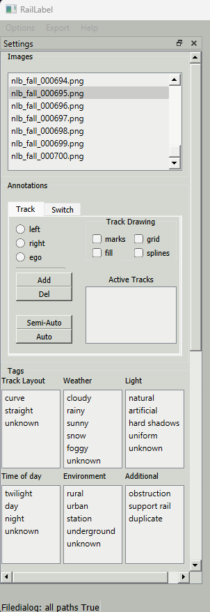
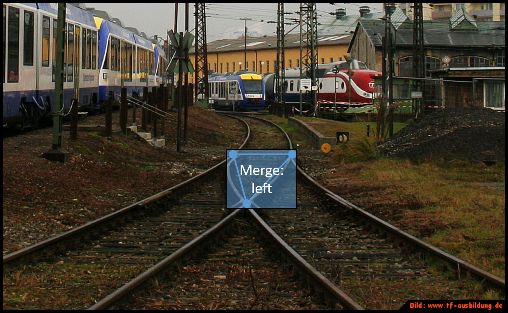

<div align="center">

</div>

[[_TOC_]]

# Installation

## Use case 1 - You want to use Labels4Rails with GUI to mark scenes:
You are a student or a member of the team, and you want to help to
extend our dataset by tagging images with the help of a GUI.

1. Clone this GIT-repository
   - `git clone git@gitlab.rz.htw-berlin.de:se_perception/raillabel.git`
   - OR `git clone https://gitlab.rz.htw-berlin.de/se_perception/raillabel.git`
2. If you are using windows you can find an executable in `raillabel_exe`. Otherwise you need to execute the following steps (which of course also work on windows).
3. Python interpreter:  
    If you are experienced you can also install your packages via pip.
    But on Windows there is no QT version of OpenCV available and the
    function is limited. Linux works just fine with pip.
    If you are inexperienced just follow the instructions.
    - Install Miniconda (sufficient and small) or Anaconda:
      [Instructions](https://docs.conda.io/projects/conda/en/latest/user-guide/install/)
4. Create, activate and install required packages into environment:
   - Open Terminal and change directory to the repository root
   - on Linux: `conda env update --file linux_environment.yml --prune`  
   - on Windows: `conda env update --file win_environment.yml --prune`
   - Activate conda environment: `conda activate Labels4Rails`

5. Launch the tool `python src/__main__.py` (or `python src\__main__.py` on windows)


## Use case 2 - You want to integrate Labels4Rails as a package
You are building a neural
network or classical image processing algorithm, and you need labels
according to the YOLO scheme or segmentation masks.
This project should be integrated as a module in your project so
that you can generate your labels from the dataset.

1. Python interpreter:  
    - Install Miniconda (sufficient and small) or Anaconda:
      [Instructions](https://docs.conda.io/projects/conda/en/latest/user-guide/install/)
2. Clone this GIT-repository:
   - `git clone git@gitlab.rz.htw-berlin.de:se_perception/raillabel.git`
   - OR: `git@gitlab.rz.htw-berlin.de:se_perception/raillabel.git`
3. Create Conda environment and install raillabel package:
   - `conda create --name railpackage python=3.9`
   - `conda activate railpackage`
   - `pip install ./raillabel`
4. Run conversion script:
    1. for YOLO labels:
      - `python raillabel/src/convert/raillabel2YOLO.py "path_to_data_batch" "directoryname_for_YOLO_labels"`
      - `path_to_data_batch` is the directory containing the folders `images`, `annotations` and `camera`
      - `directoryname_for_YOLO_labels` is relativ to `path_to_data_batch`, so the YOLO labels will be created in the directory `path_to_data_batch/directoryname_for_YOLO_labels`
    2. for pixelmasks:
      - `python raillabel\src\convert\raillabel2pixelmask.py "path_to_data_batch" "directoryname_for_pixelmasks" -c="config_file"`
      - `path_to_data_batch` is the directory containing the folders `images`, `annotations` and `camera`. Multiple paths can be listed.
      - `directoryname_for_pixelmasks` is relativ to `path_to_data_batch`, so the YOLO labels will be created in the directory `path_to_data_batch/directoryname_for_pixelmasks`
      - `"config_file"` is optional. The config file can be used to define the values/IDs for the track beds and rails and the order in which track beds and rails are drawn, e.g. draw the ego track bed and rails last, so they are completely visible. By default the masks are created using the following order and values/IDs:
          - left track bed: 85
          - left rails: 85
          - right track bed: 170
          - right rails: 170
          - ego track bed: 255
          - ego rails: 255
      - To change the used values/IDs for the track beds and rails change the variables `export_mask_color` in the config file.
      - To change the drawing order of the tracks change the variable `drawing_order` in the config file. Tracks, track beds and rails that are not listed here will not be drawn at all.
      - An example configuration can be found in `raillabel/src/convert/config_convert2pixelmask.yaml`. Create a copy and adapt it.
   3. convert yolo to raillabel:
      - `python raillabel\src\convert\yolo_to_rail_label.py "label_path" "image_path" "save_path"`
      - `label_path` is the directory containing the labels.
      - `image_path` is the directory containing the images.
      - `save_path` is the directory where the labels are saved
5. Integrate the conversion script (or parts of it) to your own project.


## Install as python package on Linux(recommended)
You may install this package system-wide, user-wide or in a virtual environment.
0. If necessary, create and activate the environment. Minimum python version is 3.9.


# Expectations for the data structure
In order to work together efficiently, it is highly recommended to use the
proposed data structure as a working directory for the label tool:
```commandline
chunk-root
├── annotations
│   ├── scene_000000.json
│   ├── scene_000001.json
│   ├── scene_.......json
│   └── scene_.....n.json
├── camera
│   └── camera.yaml
└── images
    ├── scene_000000.png
    ├── scene_000001.png
    ├── scene_.......png
    └── scene_.....n.png
```
- [mandatory] `chunk-root` is the root directory to point Labels4Rails to 
- [mandatory] `camera/camera.yaml` contains the camera extrinsic
- [mandatory] `images` contains the images to mark on
- [generated] `annotations` contains information generated by Labels4Rails

# Application

Track tab                                    |  Switch Tab
:-------------------------------------------:|:---------------------------------------------:
          |  
          |  

## General:
   - Load images/data:
      - Click on options in the left corner of the window (find an example below).
	  
	  - Click on load chunk and select the chunk folder containing your camera_extrinsic, images and annotations.
   - An image can be selected by clicking on a specific image in the list or by pressing the keys `B` and `N` to select the previous or next scene respectively.
   - The annotations of an image are saved automatically when loading a different image or closing the application.
   - Images are listed in alphabetical order.
   - To label the images keyboard input is used extensively. To see the keybindings click on `Help` -> `See Shortcuts`.
   
## Label Tracks
   - select the Tab `Track` to get into the Track-mode
   - create new track:
	 - select the attributes of the new track (radio buttons)
     - click `Add` to create a track
	  - the newly created track is selected automatically
   - edit existent track:
     - Select the track in the list
   - create new marks for a track:
     - aim on the left rail of a track and press `A`
	  - aim on the right rail of a track and press `D`
     - make as many marks as you need until you are satisfied with the result
	  - marks can be moved while pressing the right mouse button
	  - to delete a mark aim (mouse pointer will turn red) on the respective mark and press `R`
   - to change the position of an existent track, select the track, select the new direction and press `E`
   - to delete a whole track select the track in the list and click the button `Del`
   - Example on how to mark tracks: [Video](https://mediathek.htw-berlin.de/video/anleitung-labeltool/027a66a0b3dd2e3311eb840b65a88a35)
   - Example on how to delete or edit tracks: [Video](https://mediathek.htw-berlin.de/video/anleitung-labeltool/7148a8086abe71d0ba8094f2f7b58bf1)
	 
## Using the Dual-Stencil Mode to Label Tracks
   - press `W` to switch between default mode and dual-stencil mode. In dual stencil mode the left and right track can be marked simultaniuosly and there are two blue points where marks will be created.
   - by default the position of the mouse is on the left blue point. To switch the position to the right blus point press `S`
   - to create new marks press `F`
   - use `D` and `A`to adapt the distance between the blue points
   - use `+` and `-`to change the angle between the blue points
   
## Label Switches
   - select the Tab `Switch` to get into the Switch-mode  
   - create a new switch: 
      - select the switch type and direction with the radio buttons
	  - click `Add` to create a switch
	  - the newly created switch is selected automatically
   - create a bounding box for a switch:
      - two marks must be set (upper left/right and lower left/right)
	  - to set a mark aim at the desired position and press `F`
   - edit existent switch:
      - select the switch in the list
	  - to change type or direction select the new properties and press `E`
	  - the marks of the bounding box cannot be moved but deleted with `R` while aiming at them and set at a new position with `F`
   - to delete a whole switch select the switch in the list and click the button `Del`
   - Example on how to label switches: [Video](https://mediathek.htw-berlin.de/video/anleitung-labeltool/1f1264289389a826223ab9b1d3c55444)
   - Example on how to edit or delete switches: [Video](https://mediathek.htw-berlin.de/video/anleitung-labeltool/0a454eee06ad982ee61aa232bac58b39)
   
## Label Tags
  - tags can be labeled independent of the selected mode
  - click on all `tags` which describe conditions on the scene
  - tags can be deselected by clickng on them again
  - Tags can be copied from the previous image by pressing `T`:
     - if the image is the first of the chunk, `T` will be ignored
	 - tag groups that already contain a tag will not be overwritten
	 - to copy the tags and overwrite non empty tag groups,  press `O`
  - Example of labeling tags: [Video](https://mediathek.htw-berlin.de/video/anleitung-labeltool/fce3f98f52fafd8115b3f4fd1587e9ed)
# Labeling Policy
This section will briefly explain how railway scene images shall be labelled.

## Labeling railway tracks
- All tracks that are visible in the image shall be labeled
- Tracks shall only be labeled if both rails belonging to the track are visible
- Tracks shall be distinguished into ego, left neighbour and right neighbour track according to its relative position to the ego track
- Tracks shall be labeled from the beginning in the image foreground (lower image limit) up until the background as far as they are visibile with human eyes
- If switches occur in an image, tracks shall be labeled following the switch active direction (following the path, the train will go according to switch state)
- If the switch state is not visible, choose the most likely direction and label according to this direction
- Side tracks that start or end at a switches shall be labeled as neighbour tracks
- Side track rails shall be labeled throughout the whole switch in order to make switch direction visible in track masks
- If a major part of a neighbour track is hidden behind other objects, a seperate track label shall be created for the track part coming after the object
- If only a minor part of the neighbour track is hidden, the track label can be created across the object  

An example image that exemplifies the policy described above is shown below:  
  
Labels: Yellow - Ego Track ; Red - Left Neighbour Tracks ; Green - Right Neighbour Tracks

## Labeling switches
- All switches that are visible in the image shall be labeled
- Switches shall be distinguished into fork and merge type (see image below)
- The switch type is always in regard to the drive direction of the train (starting at the bottom and going "into" the image)
- If the switch status is visible, a label for the active switch direction (left or right) shall be created (see image below)
- If the switch status is not visibible, an **undefined** label shall be created (see image below)
- A Switch label bounding box shall always include all three characteristic points (represented by dots in the images below) and furthermore show the complete path of the rails  
   
- In case of cross switches, two fork type labels shall be created for both tracks going into the switch as shown in the following images:  
 

## Labeling Tags
### Tracklayout
At least one, 'curve' or 'straight' must be set. 
- straight: if at least one track is straight
- curve: if at least one track is curved

Both are selected if there are curved and straight tracks.

- uphill, downhill: If a track is 'uphill' or 'downhill' can sometimes only be identified when looking at a sequence of images as at some point the camera angle changes. The images should then be tagged accordingly, even if the 'uphill' or 'downhill' feature is not clearly visible in the image itself.
- unknown: if the tracks are not visible due to lighting (dark tunnels) or weather conditions (fog).

### Weather
Weather tags are set depending on the impact they have on the tracks:
- cloudy: Tracks are not illuminated by the sun. This can be the case even if blue sky is visible.
- rainy: Ground is wet or raindrops on the camera lens.
- sunny: Tracks are illuminated by the sun. This can be the case even if the visible sky is clouded.
- snow: Ground is covered with snow. If it is snowing the 'rainy' tag must be set as well.
- foggy: The visibility of the tracks is limited due to fog. Fog obscurring other things is irrelevant.
- unknown: Weather conditions cannot be determined due to tunnels etc.

### Light
- natural, artificial: the scene is lluminated by the sun or artificial light accordingly. In some cases both, 'natural' and artifical' must be set. In case there is not light, none is set.
- dark, bright: taking into account 'Weather', the area of the tracks is considerably dark or bright.
- hard shadows: Only set, if at least one rail is crossed by a shadow. Surroundings and shadows cast by the rails itself are not considered.
- uniform: Tracks are evenly illumitated.

### Time of Day
If the time of day cannot be taken from the data (e.g. ros-bag names), it must be estimated using the weather and the light conditions.

### Environment
- rural: if there are natural surfaces in the immediate vicinity of the rails or the majority of the surroundings are natural.
- urban: if there are artificial/man-made objects in the immediate vicinity of the rails or the majority of the surroundings are artificial. Tunnels in rural areas are not considered artificial.
- station: if a station is visible in the image, even if the train has not entered the station yet.
- staging yard:
- underground: if the tracks or parts of them are underground, at a tunnel entrance/exit.

### Examples
Image                                  |  Tags
:-------------------------------------------:|:----------------------------:
  |  **Track  Layout:** straight, curve <br>**Weather:** cloudy<br>**Light:** natural, bright, uniform<br>**Time of Day:** day<br>**Environment:** rural, urban
  |  **Track  Layout:** straight, curve <br>**Weather:** cloudy<br>**Light:** natural, dark, uniform<br>**Time of Day:** twilight<br>**Environment:** urban
  |  **Track  Layout:** curve <br>**Weather:** sunny<br>**Light:** natural, bright<br>**Time of Day:** day<br>**Environment:** rural, urban
  |  **Track  Layout:** curve <br>**Weather:** sunny<br>**Light:** natural, bright, hard shadows<br>**Time of Day:** day<br>**Environment:** rural 
  |  **Track  Layout:** curve, uphill <br>**Weather:** cloudy<br>**Light:** natural, bright, uniform<br>**Time of Day:** day<br>**Environment:** rural 
  |  **Track  Layout:** curve <br>**Weather:** cloudy<br>**Light:** natural, dark, uniform<br>**Time of Day:** night<br>**Environment:** rural 
  |  **Track  Layout:** curve <br>**Weather:** sunny<br>**Light:** natural, dark <br>**Time of Day:** day<br>**Environment:** underground, rural 
  |  **Track  Layout:** curve <br>**Weather:** cloudy<br>**Light:** natural, uniform <br>**Time of Day:** day<br>**Environment:** rural 
  |  **Track  Layout:** curve <br>**Weather:** cloudy, rainy <br>**Light:** natural, uniform <br>**Time of Day:** day<br>**Environment:** rural 
  |  **Track  Layout:** curve <br>**Weather:** cloudy <br>**Light:** natural, dark, uniform <br>**Time of Day:** twilight<br>**Environment:** rural, urban
  |  **Track  Layout:** straight <br>**Weather:** cloudy, snowy, rainy <br>**Light:** natural, uniform, bright <br>**Time of Day:** day <br>**Environment:** rural  
  |  **Track  Layout:** straight <br>**Weather:** sunny <br>**Light:** natural, hard shadows <br>**Time of Day:** day<br>**Environment:** rural, urban, station 
  |  **Track  Layout:** straight <br>**Weather:** sunny <br>**Light:** natural, bright, hard shadows <br>**Time of Day:** day<br>**Environment:** rural, urban, station 
  |  **Track  Layout:** curve <br>**Weather:** sunny <br>**Light:** natural, dark <br>**Time of Day:** day<br>**Environment:** rural
  |  **Track  Layout:** curve <br>**Weather:** sunny <br>**Light:** natural, bright, uniform <br>**Time of Day:** day<br>**Environment:** rural, urban


## Qt-GUI
### QtDesigner
* open QtDesigner and load ui-file from .../src/gui/qt/design/prototype_flow.ui (...or create a new design)
* the design may can be modified here
* save the changes
* convert the ui-file to python code with CLI-command (without brackets): 
```
pyuic5 [path_to_ui_file/filename.ui] -o [output_path/new_filename.py]
```
* in this file, comment out all lines which contain:
```
QtGui.QPalette.PlaceholderText
```
* Replace the content in src/gui/qt/gui_init.py with the content of your new .py file 

